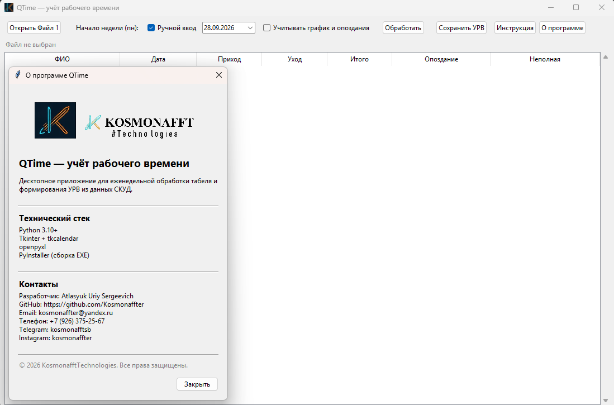
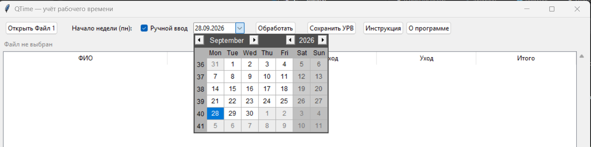
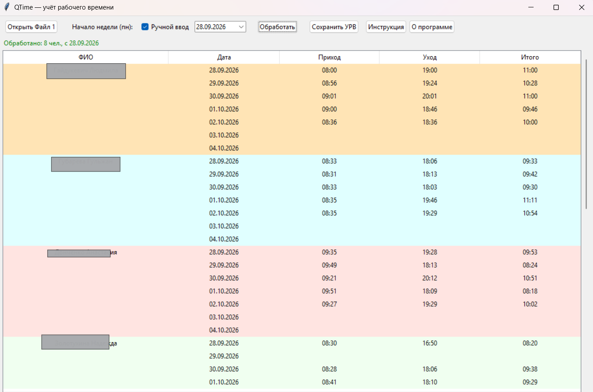
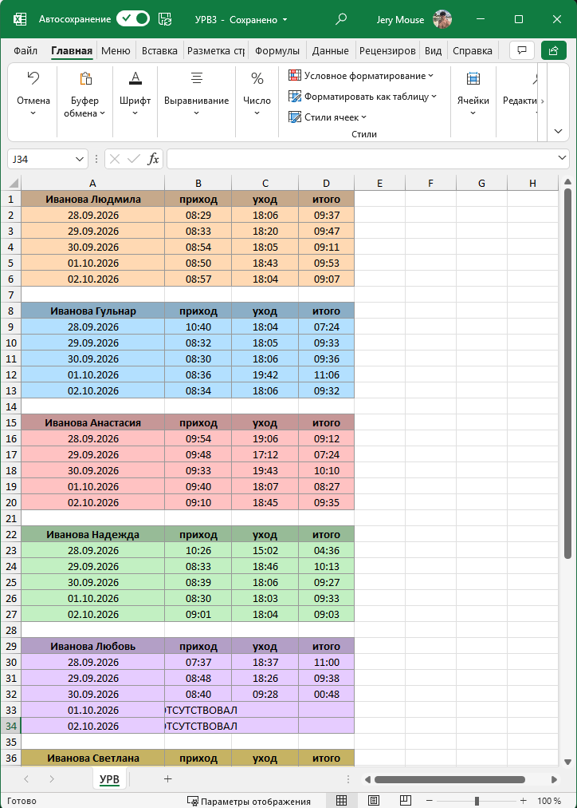

<div align="center">

# QTime

**Десктопное приложение для учёта рабочего времени и формирования УРВ**


</div>

---

## Содержание

- [О проекте](#о-проекте)
- [Возможности](#возможности)
- [Скриншоты](#скриншоты)
- [Установка](#установка)
- [Запуск](#запуск)
- [Сборка EXE](#сборка-exe)
- [Структура проекта](#структура-проекта)
- [Как это работает](#как-это-работает)
- [Графики и опоздания](#графики-и-опоздания)
- [Формат данных](#формат-данных)
- [Обработка ошибок](#обработка-ошибок)
- [О программе](#о-программе)
- [Лицензия](#лицензия)

<p align="right"><a href="#содержание">↑ к содержанию</a></p>

---

## О проекте

**QTime** — утилита для еженедельной обработки табеля рабочего времени.
Берёт «сырой» Excel-файл с отметками СКУД и формирует готовый **УРВ**
(учёт рабочего времени) с расчётом отработанных часов по каждому
сотруднику.

Приложение рассчитано на бухгалтеров, кадровиков и руководителей,
которые каждый понедельник вручную переносят данные за прошлую неделю.

<p align="right"><a href="#содержание">↑ к содержанию</a></p>

---

## Возможности

- Импорт Excel-файла «Отработанное время за месяц».
- **Гибкий поиск шапки** — программа сама находит строку с заголовком
  «Фамилия» и строку начала данных, независимо от того, где они лежат.
- Выбор даты начала недели: **интерактивный календарь** или ручные поля.
- Автоматический расчёт отработанного времени (`приход` → `уход`).
- Поддержка неполных смен:
  - одно время до 13:00 → `приход`, `уход = нет выхода`;
  - одно время после 13:00 → `уход`, `приход = нет входа`;
  - нет обоих → `ОТСУТСТВОВАЛ`.
- **Графики и опоздания** — опциональная галочка открывает окно
  настроек: для каждого сотрудника задаётся начало смены и график
  (9 или 12 часов). Программа определяет `опоздание`, `не полная
  смена` и `ОК`, показывает отклонения в минутах.
- **Цветовая индикация статусов**: красный — опоздание, оранжевый —
  не полная смена, зелёный — всё в порядке.
- Пустые сб/вс **не попадают** в итоговый файл.
- Период чтения — до **31 дня**.
- Каждый сотрудник получает **уникальный контрастный цвет**,
  сохраняемый в Excel.
- Экспорт в новый `.xlsx` с границами, заливкой и статусными
  колонками.
- **Понятные сообщения об ошибках** — без трейсбеков и кодов errno.
  Отдельно обрабатывается устаревший формат `.xls`.
- Встроенные окна «О программе» и «Инструкция».

<p align="right"><a href="#содержание">↑ к содержанию</a></p>

---

## Скриншоты

### Главное окно



### Выбор даты через календарь



### Готовый УРВ



### Готовый Excel



<p align="right"><a href="#содержание">↑ к содержанию</a></p>

---

## Установка

### Требования

- Python 3.10+
- Windows 10/11

### Шаги

```bash
git clone https://github.com/Kosmonaffter/QTime.git
cd QTime
python -m venv .venv
.venv\Scripts\activate
pip install -r requirements.txt
```

### `requirements.txt`

```
openpyxl>=3.1.0
tkcalendar>=1.6.1
```

<p align="right"><a href="#содержание">↑ к содержанию</a></p>

---

## Запуск

```bash
python main.py
```

<p align="right"><a href="#содержание">↑ к содержанию</a></p>

---

## Сборка EXE

### Вариант 1 — один файл (`--onefile`)

Самый удобный для раздачи: пользователь скачивает **один** `.exe`
и запускает без дополнительных папок.

```bash
pip install pyinstaller

# 1) однострочная команда
pyinstaller --noconfirm --clean QTime.spec

# 2) или многострочная
pyinstaller --noconfirm --clean --onefile --windowed ^
  --name QTime ^
  --icon assets/qtime.ico ^
  --add-data "assets;assets" ^
  main.py
```

Готовый файл: `dist/QTime.exe`.

### Вариант 2 — папка (`--onedir`)

Быстрее стартует, но требует распространять всю папку.

```bash
pyinstaller --noconfirm --clean QTime.spec
```

Готовый файл: `dist/QTime/QTime.exe` (рядом — папка `_internal`).

### `build.bat`

```bat
@echo off
chcp 65001 > nul
echo === Сборка QTime ===

python -m venv .venv
call .venv\Scripts\activate

pip install --upgrade pip
pip install -r requirements.txt
pip install pyinstaller

pyinstaller --noconfirm --clean QTime.spec

echo.
echo === Готово: dist\QTime\QTime.exe ===
pause
```

### Что нужно знать

- **SmartScreen** при первом запуске скажет «неопознанное приложение».
  Нажми «Подробнее» → «Выполнить в любом случае».
- **`--onefile`** распаковывается во временную папку при каждом
  запуске — первый старт занимает 2–5 секунд.
- **Антивирус** может ругаться на EXE без цифровой подписи. Добавь
  в исключения.
- **Иконка** кладётся в `assets/qtime.ico` и указывается флагом
  `--icon`.

<p align="right"><a href="#содержание">↑ к содержанию</a></p>

---

## Структура проекта

```
QTime/
├── main.py
├── requirements.txt
├── QTime.spec
├── QTime-onefile.spec
├── build.bat
├── README.md
├── LICENSE
├── .gitignore
├── assets/
│   └── qtime.ico
├── docs/
│   ├── screenshot-main.png
│   ├── screenshot-calendar.png
│   ├── screenshot-result.png
│   └── screenshot-for_excel.png
├── core/
│   ├── __init__.py
│   ├── constants.py
│   ├── color_utils.py
│   ├── errors.py
│   ├── time_utils.py
│   ├── source_reader.py
│   ├── schedule.py
│   └── target_writer.py
└── ui/
    ├── __init__.py
    ├── app_window.py
    ├── about_dialog.py
    ├── help_dialog.py
    └── schedule_dialog.py
```

<p align="right"><a href="#содержание">↑ к содержанию</a></p>

---

## Как это работает

1. Открываем **Файл 1** — «Отработанное время за месяц».
2. Указываем **дату начала недели** (календарь или ручные поля).
3. Нажимаем **«Обработать»** — данные попадают в таблицу
   предпросмотра.
4. Нажимаем **«Сохранить УРВ»** — получаем новый Excel-файл.

### Логика разбора ячейки

Ячейка одного дня выглядит так:

```
08:58    ← приход
19:00    ← уход
------
8:00     ← игнорируется
```

Берём первые две строки до `------`. Всё, что ниже, не учитывается.

### Если в ячейке одно время

| Ситуация      | Приход         | Уход         |
|---------------|----------------|--------------|
| время < 13:00 | `HH:MM`        | `нет выхода` |
| время ≥ 13:00 | `нет входа`    | `HH:MM`      |
| нет обоих     | `ОТСУТСТВОВАЛ` | —            |

### Пустые сб и вс

Не попадают в итоговый файл — для них строки не создаются.

<p align="right"><a href="#содержание">↑ к содержанию</a></p>

---

## Графики и опоздания

Если включить галочку **«Учитывать график и опоздания»** перед
нажатием «Обработать», появится окно настроек:

- **Начало смены** — время в формате `HH:MM`, вводится вручную.
- **График** — `9` или `12` часов.

По умолчанию: `09:00`, 9 часов.

### Что считается отклонением
```
| Ситуация                          | Статус                  |
|-----------------------------------|-------------------------|
| Приход позже начала смены         | `опоздание +0:15`       |
| Отработано меньше нормы           | `не полная смена −0:30` |
| Приход вовремя и норма отработана | `ОК`                    |
| Переработка                       | не считается            |
```
Оба статуса могут стоять в одной строке (например, `опоздание` +
`не полная смена`).

### Цвета строк

- 🔴 красный — опоздание
- 🟠 оранжевый — не полная смена
- 🟢 зелёный — всё в порядке
- цвет сотрудника — нет данных или график не задан

<p align="right"><a href="#содержание">↑ к содержанию</a></p>

---

## Формат данных

### Файл 1 — «Отработанное время за месяц»
```
| A |              B               |        C      |        D      |    E   | ... |
|---|------------------------------|---------------|---------------|--------|-----|
| № | Фамилия, инициалы, должность | 28 пн         | 29 вт         | 30 ср  | ... |
| 1 | Иванова Людмила              | 08:58 / 19:00 | 08:56 / 19:24 | ...    | ... |
```
**Важно:** шапка может быть не в первой строке. Программа ищет
заголовок по слову **«Фамилия»** и стартует данные со следующей
строки. Колонка с датами — сразу справа от ФИО.

### Файл 2 — УРВ (результат)

**Без графика** (галочка выключена):
```
|      A     |    B   |   C   |   D   |
|------------|--------|-------|-------|
| ФИО        | приход | уход  | итого |
| 28.09.2026 | 08:58  | 19:00 | 10:02 |
| 29.09.2026 | 08:56  | 19:24 | 10:28 |
```
**С графиком** (галочка включена) — добавляются колонки:
```
|      A     |    B   |    C  |    D  |       E         |            F          |
|------------|--------|-------|-------|-----------------|-----------------------|
| ФИО        | приход | уход  | итого |    статус 1     |         статус 2      |
| 28.10.2026 | 09:30  | 18:30 | 09:00 | опоздание +0:30 |                       |
| 29.10.2026 | 09:00  | 17:30 | 08:30 |                 | не полная смена −0:30 |
| 30.10.2026 | 10:10  | 21:00 | 10:50 | опоздание +0:10 | не полная смена −1:10 |
```
Каждый сотрудник выделен своим цветом. Строка окрашивается по
**приоритету статуса**: `опоздание` (красный) > `не полная смена`
(оранжевый) > `ОК` (зелёный) > цвет сотрудника. Между блоками
сотрудников — пустая строка.

<p align="right"><a href="#содержание">↑ к содержанию</a></p>

---

## Обработка ошибок

Все технические исключения превращаются в понятные сообщения.
Отдельно обрабатывается **устаревший формат `.xls`**: программа
не читает его и предлагает сохранить файл как `.xlsx`.
```
|          Ситуация          |                                  Что увидит пользователь                              |
|----------------------------|---------------------------------------------------------------------------------------|
| Файл открыт в Excel        | «Файл открыт в другой программе (например, Excel). Закройте его и повторите попытку.» |
| Файл удалён / переименован | «Файл не найден. Возможно, он был перемещён или удалён.»                              |
| Нет прав на чтение         | «Нет доступа к файлу. Проверьте права или закройте его в других программах.»          |
| Не Excel / повреждён       | «Не удалось прочитать файл. Возможно, он повреждён или это не Excel-файл.»            |
| Формат `.xls`              | «Файл в устаревшем формате .xls. Программа работает с современным форматом 
                              .xlsx. Откройте файл в Excel и сохраните как «Книга Excel (*.xlsx)»,
                              затем повторите попытку.»                                                              |
| Нет шапки «Фамилия»        | «В файле не найдена строка с заголовком Фамилия. Проверьте, что это тот самый файл.»  |
| Нет данных                 | «В файле нет данных о сотрудниках.»                                                   |
| Не удалось сохранить       | «Не удалось сохранить файл. Возможно, он открыт в Excel или нет прав на запись.»      |
```
<p align="right"><a href="#содержание">↑ к содержанию</a></p>

---

## О программе

**QTime** — внутренний инструмент для автоматизации еженедельного
формирования УРВ.

### Технический стек

- Python 3.10+
- Tkinter + tkcalendar
- openpyxl
- PyInstaller (сборка EXE)

### Разработчик

- **ФИО:** Atlasyuk Uriy Sergeevich
- **GitHub:** [Kosmonaffter](https://github.com/Kosmonaffter)
- **Email:** kosmonaffter@yandex.ru
- **Телефон:** +7 (926) 375-25-67
- **Telegram:** `kosmonafftsb`
- **Instagram:** `kosmonaffter`

© 2026 KosmonafftTechnologies. Все права защищены.

<p align="right"><a href="#содержание">↑ к содержанию</a></p>

---

## Лицензия

MIT. См. [LICENSE](LICENSE).

<p align="right"><a href="#содержание">↑ к содержанию</a></p>